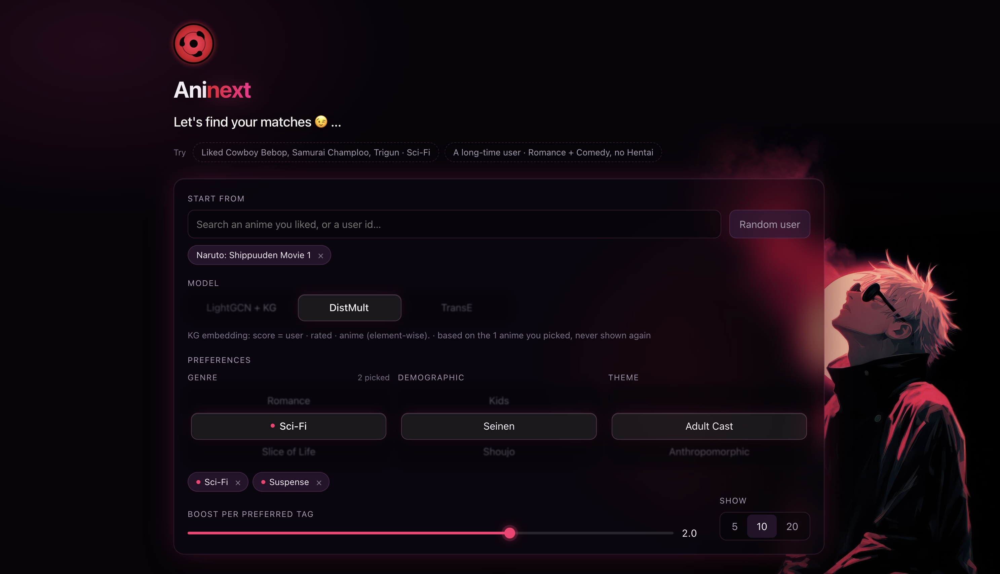

<p align="center">
  
</p>

<h1 align="center">KG_26 — Knowledge Graphs on anime data</h1>

<p align="center"><b><a href="https://ikc-arya.github.io/KG_26/">Aninext</a></b>: the recommender as a web page. Pick anime you liked, tune genres and themes, compare six models.</p>

<p align="center">
  <a href="https://ikc-arya.github.io/KG_26/"></a>
</p>

Build a knowledge graph from MyAnimeList data (ontology → RDF triples), embed it (DistMult, TransE), run a GNN on it (LightGCN), and study how the embeddings react when the graph evolves. The downstream task is anime recommendation, framed as link prediction on `user → rated → anime` edges. Everything is hand-written on rdflib / plain PyTorch so each step stays inspectable.

## Layout

| Folder | What's in it |
|---|---|
| `Apply/src/` | The real pipeline: ontology, triple generation + validation, split, trainers, evaluator, probe |
| `Apply/*.ipynb` | `eda.ipynb` (data decisions), `embeddings_trials.ipynb`, `gnn_trials.ipynb` (small experiments behind each modelling choice) |
| `Apply/notes.md` | Stage-by-stage write-up with results |
| `Apply/data/` | Raw CSVs go here (not included, see below); `generated/` holds pipeline outputs |
| `Learn/01_ontology` … `Learn/04_evolution` | Concept notes + one trials notebook per stage (toy experiments behind the design choices) |
| `_context/glossary.md` | Terms used throughout |

## Setup

Python 3.14 (tested with 3.14.7).

```bash
python -m venv .venv && source .venv/bin/activate
pip install -r requirements.txt
```

## Data

Two public CSVs, both keyed on the MyAnimeList id. Download them and place them in `Apply/data/`:

| File | Content | Source |
|---|---|---|
| `anime.csv` | 28,627 anime: title, genres, themes, studios, producers, licensors, type, source, … | MyAnimeList-derived *Anime Dataset*, [hyper.ai/en/datasets/42346](https://hyper.ai/en/datasets/42346) (torrent mirror of the Kaggle release). The exact file used is included in `Apply/data/` for reproducibility. |
| `rating.csv` | 7.8M user–anime ratings (`user_id, anime_id, rating`; `-1` = watched, not scored) | [rai-shivangi/Anime_-recommendation_-system](https://github.com/rai-shivangi/Anime_-recommendation_-system) → `rating.csv.zip` (unzip) |

The train/valid/test split used for all reported results is included in `Apply/data/generated/split/` (see *Reproducibility*).

## Run order

All scripts resolve paths from their own location, so they can be run from any directory.

```bash
# 1. Ontology: parse + OWL-RL closure + checks on the TBox and a small real ABox   (seconds)
python Apply/src/build_ontology.py

# 2. Triples: CSV -> abox.ttl (reified RDF) + triples.tsv (flat h,r,t)              (~2 min)
python Apply/src/build_triples.py            # --n-users 5000 --min-ratings 20 --seed 26
python Apply/src/validate_triples.py         # 15 checks, full parse takes a few minutes

# 3. Split: SHIPPED in Apply/data/generated/split/. To regenerate an equivalent one:
python Apply/src/make_split.py --out Apply/data/generated/split_regen

# 4. Baseline + KG embeddings                                                       (~5-10 min each, CPU)
python Apply/src/recsys_eval.py              # popularity baseline
python Apply/src/train_kge.py                # DistMult
python Apply/src/train_kge.py --model transe # TransE
python Apply/src/probe_embeddings.py         # neighbours / example recs by title -> results/probe.md

# 5. GNN (LightGCN)                                                                 (~20-60 min each, CPU)
python Apply/src/train_gnn.py --layers 0     # = matrix factorisation
python Apply/src/train_gnn.py                # 3 layers
python Apply/src/train_gnn.py --content      # 3 layers + KG content edges
python Apply/src/representation_examples.py  # 5 node/edge examples from the checkpoints -> results/representation.md

# 6. Logic on the real ABox: OWL-RL typing, CONSTRUCT rule, recursive path, explanation, constraints (~20 s)
python Apply/src/logic_queries.py            # -> results/logic.md

# 7. Evolve the KG on disk: rule-inferred edges, reified ML predictions, update on new facts (~4 min)
python Apply/src/evolve_kg.py                # -> data/generated/evolution/, results/evolution.md

# 8. The service: recommendations tuned by stated preferences (existing or brand-new user)
python Apply/src/recommend.py --user user_66835 --prefer Romance,Comedy --avoid Hentai
python Apply/src/recommend.py --liked "Cowboy Bebop,Samurai Champloo,Trigun" --prefer SciFi --boost 0.5
```

Metrics land in `Apply/data/generated/results/<model>.json`, checkpoints in `Apply/data/generated/models/`.

Notebooks run top to bottom from their own folder (`jupyter lab`, or `jupyter nbconvert --execute`). The Apply trials notebooks need the split (and `probe`/evolution ones the trained DistMult checkpoint); each runs in under ~10 min on a 1,000-user subset.

## Aninext (web UI)

The service from step 8 as a web page: pick an existing user or type a few anime you liked, click genres/themes to prefer or avoid, and compare *from watch history* with *tuned to you*. Any of the six scorers can be picked (popularity, MF, LightGCN, LightGCN + KG, DistMult, TransE).
It is hosted on GitHub Pages from `docs/`. Pages is static, so `export_web.py` exports the LightGCN vectors and the KG tag index once, and the re-rank (`recommend.rerank`) runs in the browser.

```bash
python Apply/src/web/export_web.py   # rebuild docs/ (index.html + data/, ~30 s); self-checks against recommend.py
python Apply/src/web/serve.py        # local preview with live reload -> http://127.0.0.1:8026
```

## Reproducibility

- All randomness is seeded (`--seed 26`); CPU runs reproduce metrics exactly.
- The script that produced the shipped split was lost before it was committed. Its rule is known and re-implemented in `make_split.py` (per-user holdout of `rated` edges, 10% test / 10% valid, cold-start edges dropped); only the random draw differs. The original split files are therefore shipped as data, and `Apply/notes.md` records that a regenerated split gives the same results within noise.
